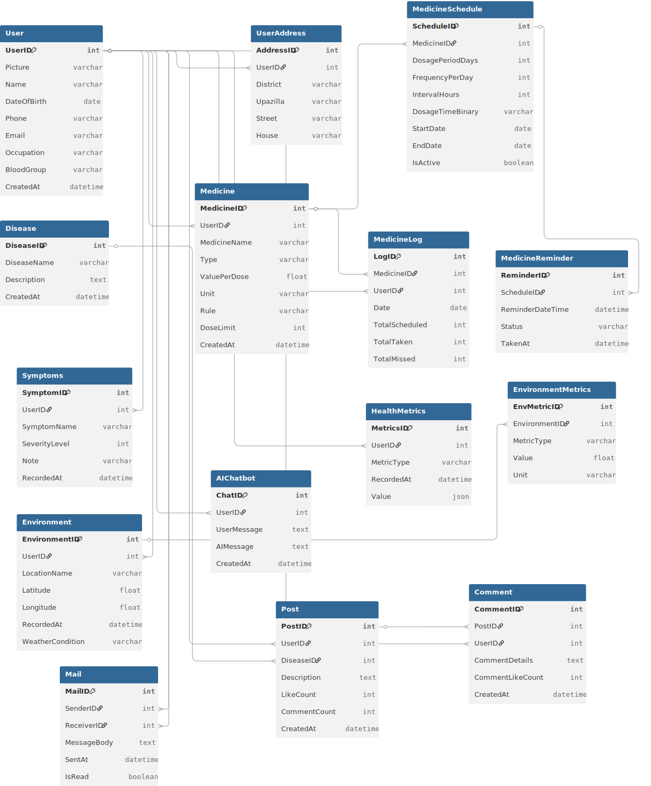

# MyDoctor

MyDoctor is a data-driven personal health assistant. It collects and analyzes user health data (current diseases, symptoms, health metrics, reports/prescriptions, and environment) to generate personalized recommendations, reminders, and summaries.

## Reference Apps & Websites

These references inspired the feature set. MyDoctor’s goal is to unify them into a single system where **user data drives personalized suggestions**.

### 1) MyTherapy (App)

- Website: https://www.mytherapyapp.com/
- Play Store: https://play.google.com/store/apps/details?id=eu.smartpatient.mytherapy&hl=en
- Reference features: medicine reminder, symptom check, health tracker
- MyDoctor difference: collects and analyzes user disease + symptom + metric data and provides **personalized health recommendations** (not only tracking).

### 2) PatientsLikeMe (Website)

- Link: https://www.patientslikeme.com/
- Reference features: disease-based community groups
- Problem in reference: difficult to post when a user has multiple diseases; important posts can be missed across groups
- MyDoctor difference: **newsfeed-style community** where posts can have **multiple disease tags**, and users can filter/search by tags. Also includes **private mailing** for health-related communication.

### 3) Doctime (App)

- Website: https://doctime.com.bd/
- Play Store: https://play.google.com/store/apps/details?id=com.media365ltd.doctime&hl=en
- Reference features: online doctor consultations, prescriptions, medicine delivery, diagnostics, subscriptions
- MyDoctor difference: does **not** introduce doctors; the system focuses on collecting data and providing key suggestions automatically.

### 4) IQAir (Website)

- Link: https://www.iqair.com/
- Reference features: air quality monitoring and pollution insights
- MyDoctor difference: uses **air + weather APIs** to produce more accurate environment-aware suggestions for the user’s location.

## Feature Reference (Quick Comparison)

| Reference | What the reference has | What MyDoctor adds |
|---|---|---|
| MyTherapy | Reminders + tracking | Personalized recommendations based on diseases/metrics/symptoms |
| PatientsLikeMe | Disease-based groups | Multi-tag newsfeed + filtering + private mailing |
| Doctime | Doctor consultations & services | Automated analysis + key suggestions (no doctors) |
| IQAir | Air quality data | Environment-aware guidance using air + weather APIs |

## Main Features (Highlights)

- Personalized health recommendations from user data
- Health tracking: inputs, visualizations, symptoms, reports, prescriptions
- Dashboard: analysis, detailed health summary, daily environment-based guide
- Medicine: input, reminders, and tracking
- Chatbot: person-specific responses using database context + AI-powered suggestions
- Community: smart feed, multi-disease tagging, likes, comments, disease-based filtering
- Mailing: private health-related communication between users
- Notifications: pop-ups, settings, and a smart notification algorithm

## Feature Details

### `feature/profile`

- Profile page to store personal and medical context (diseases, baseline information).
- Activity log to track user actions and updates.
- Profile summary with specific suggestions derived from stored profile + tracking history.

### `feature/health-track`

- Health information input (metrics, symptoms, reports, prescriptions).
- Health visualization (graphs/summary views for tracked data).
- Organized record of symptoms, reports, and prescriptions to support better analysis.

### `feature/dashboard`

- Data analysis module that summarizes tracked health information.
- Detailed health summary report (user-friendly, actionable view).
- Environment + health-based daily guide (combines user data with environment signals).

### `feature/chatbot`

- Chatbot integrated with the database (reads user context before responding).
- Person-specific, effective responses based on diseases, symptoms, and tracked metrics.
- AI-powered suggestions to improve the quality and relevance of guidance.

### `feature/mailing`

- Send email to any user (health-related private communication).
- Mailbox UI for writing, receiving, and viewing conversations.

### `feature/home`

- Home page elements that introduce the system and recent highlights.
- Navigation elements for quick access to major modules.

### `feature/login`

- Login and registration.
- Email verification.
- Forgot password / reset password flow.

### `feature/medicine`

- Medicine input page (name, dose, schedule, etc.).
- Medicine reminder system.
- Medicine tracker to mark taken/missed doses and observe adherence trends.

### `feature/community`

- Smart community feed (newsfeed) instead of strict disease-only groups.
- Post creation with multiple disease tags.
- Like and comment system on posts.
- Disease-based filtering so users can quickly find relevant posts.

### `feature/notification`

- Notification pop-ups for events (reminders, updates, community interactions).
- Notification settings (user preferences).
- Push notification system with a smart algorithm.

### Environment Integration

- Fetch air quality and weather data (API-based).
- Use environment data with user health context to produce better daily guidance.

## Work Distribution

| Member | Modules |
|---|---|
| Kazi Rifat Al Muin (2107042) | `feature/profile`, `feature/health-track`, `feature/dashboard`, `feature/chatbot`, `feature/mailing` |
| Dipta Chowdhury (2107038) | `feature/home`, `feature/login`, `feature/medicine`, `feature/community`, `feature/notification` |

## Tech Stack

- Backend: Laravel (PHP)
- Frontend: Blade + Vite
- Database: MySQL

## Setup (Local Development)

Prerequisites: PHP 8.1+, Composer, Node.js, and a database.

```powershell
# Install backend dependencies
composer install

# Create environment file and app key
Copy-Item .env.example .env
php artisan key:generate

# Configure DB in .env, then migrate + seed
php artisan migrate
php artisan db:seed

# Frontend dependencies + dev build
npm install
npm run dev

# Run the app
php artisan serve

# Turn On the Medicine Reminder ( Email & Push Notification )
php artisan schedule:work
```

## Documentation diagrams

Key design diagrams are stored in the `doc/` folder — embedded below for quick reference.

**File tree:**

```
doc/
├── ER_diagram.svg
└── schema_diagram.svg
```

**ER diagram**


**Schema diagram**



<p align="center"><a href="https://laravel.com" target="_blank"></a></p>

<p align="center">
<a href="https://github.com/laravel/framework/actions"></a>
<a href="https://packagist.org/packages/laravel/framework"></a>
<a href="https://packagist.org/packages/laravel/framework"></a>
<a href="https://packagist.org/packages/laravel/framework"></a>
</p>
