# MyDoctor - Complete Healthcare Management Platform

**Visit Website:** https://mydoctor.rifatalmuin.com/

MyDoctor is a comprehensive healthcare management system that helps users track health metrics, manage medications, receive AI-powered health insights, and connect with a supportive community. Built with Laravel, it serves as a personal health companion for patients managing chronic conditions, caregivers, and health-conscious individuals.

## Problem It Solves

Managing personal health data across multiple platforms is challenging. Patients often forget medications, struggle to track health metrics, symptoms and diseases over time, lack personalized health insights, don't have any community support. Healthcare providers lack visibility into patients' daily health patterns between visits. MyDoctor solves this by providing a unified platform for health tracking, personalized suggestions, medication management, community support with the integration of smart AI-based quick and easy health summary through chatbot.

## Target Users

- **Patients with chronic conditions** (diabetes, hypertension, asthma, etc.)
- **Elderly users** needing medication reminders
- **Caregivers** tracking multiple family members
- **Health-conscious individuals** monitoring wellness metrics

---

## Key Features

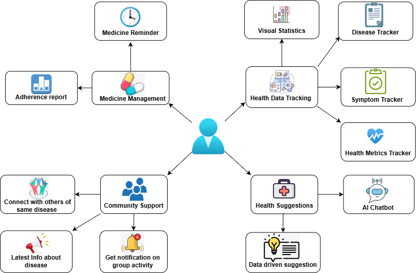

### Core Features

- **User Authentication** - Registration, login, email verification, password reset, role-based access (Admin/Member)
- **Health Metrics Tracking** - Blood pressure, glucose, heart rate, weight, BMI, oxygen saturation, temperature, cholesterol, hemoglobin, creatinine
- **Symptom Logger** - Track symptoms with severity levels (1-10), add notes, view historical trends and charts
- **Medicine Management** - Complete CRUD for medicines with dosage, type, timing rules, and daily limits
- **Medicine Scheduling** - Create schedules with multiple times per day, custom intervals, start/end dates
- **Medicine Reminders** - Automatic notification generation, email alerts, in-app notifications with "Taken/Missed" buttons
- **Adherence Tracking** - Daily logs with adherence rates, 30-day trend charts, CSV export
- **Medical Document Storage** - Upload prescriptions and reports with metadata (doctor, institution, date, notes)
- **Disease Management** - Track diagnosed conditions with status (active/chronic/managed/recovered) and diagnosis dates
- **Community Forum** - Disease-based discussions, anonymous posting, admin approval workflow, likes, comments, file attachments, YouTube embedding
- **Internal Messaging** - Gmail-like mailbox with drafts, starring, archiving, read/unread status, rich text editor
- **Admin Dashboard** - User management, disease/symptom catalogs, health metric definitions, community moderation, activity logs

### Advanced/Unique Features

- **AI-Powered Health Assistant** - Conversational chatbot with personal health data access, using OpenRouter API (multiple LLM fallbacks) + Google Gemini support
- **Text-to-SQL Query Engine** - Ask natural language questions about your health data; AI converts to SQL with automatic user-scoping for security
- **Personal Health Snapshot** - AI-generated health summaries with personalized suggestions based on actual user data, diseases, and symptoms
- **Weather-Aware Health Advice** - Live weather and air quality integration with location-based health recommendations
- **Smart Suggestions Engine** - Automated health recommendations based on abnormal metrics, low adherence, severe symptoms, and active conditions
- **Star System** - Follow diseases and star posts to receive relevant notifications about updates
- **Bilingual Support** - Full English and Bangla (Bengali) interface with automatic language switching
- **Bangladesh-Specific Address System** - Division/District/Upazila hierarchy with Geo API integration
- **Activity Logging** - Automatic audit trails of all user's activity
- **Database Backup System** - Automatic database backup after 12hrs as an step for failure management

---

## System Architecture

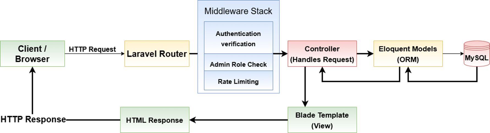

### Overall Architecture

The system follows the **Model-View-Controller (MVC)** architectural pattern within a **client-server** model. It is designed as a monolithic Laravel application, not microservices, which simplifies deployment and maintenance for a healthcare management platform.

**Client Layer (Frontend)**
- The browser renders Blade templates with Bootstrap 5 and vanilla JavaScript
- All pages are server-rendered
- AJAX requests for dynamic features (notifications, post likes, comments, chatbot)
- Static assets (CSS, JS, images) are compiled via Vite and served from the public directory

**Application Layer (Backend)**
- Laravel handles HTTP requests through its middleware pipeline
- Requests pass through authentication, verification, and authorization middleware before reaching controllers
- Controllers orchestrate business logic, validate input, and call models or services
- Services encapsulate complex operations (AI chat, weather data, activity logging)
- Queue system processes background jobs (emails, notifications when configured)

**Database Layer**
- MySQL stores all persistent data with proper indexing for performance
- Read-only connection option exists for chatbot SELECT queries

### Frontend, Backend, and Database Interaction

**Standard Page Request Flow**
1. Browser sends HTTP request to Laravel (e.g., loading dashboard)
2. Laravel middleware processes the request (auth check, locale setting, activity logging)
3. Route directs request to appropriate controller method
4. Controller queries database via Eloquent models
5. Controller passes data to Blade view
6. Blade compiles HTML with embedded PHP and returns response

**Dynamic/AJAX Interaction Flow**
1. User performs action (clicking like, submitting comment, sending chat message)
2. JavaScript sends fetch request to API endpoint with JSON payload
3. Server validates, processes, and returns JSON response
4. JavaScript updates DOM dynamically without page reload

**Background Processing Flow**
1. Cron job triggers scheduler every minute
2. Scheduler runs `reminders:send` command
3. Command queries due reminders from database
4. Notifications are created and emails queued (if queue worker running)
5. Database triggers automatically update medicine logs when reminder status changes

## Database Design

### Core Tables

| Table Name | Description | Key Fields |
|------------|-------------|------------|
| `users` | User accounts | id, name, email, password, role, is_active |
| `user_settings` | User preferences | email_notifications, show_chatbot, show_notification_badge |
| `user_addresses` | Bangladesh address | division, district, upazila, street, house |
| `health_metrics` | Metric definitions | metric_name, fields (JSON) |
| `user_health` | User health records | user_id, health_metric_id, value (JSON), recorded_at |
| `symptoms` | Symptom catalog | name, name_bn |
| `user_symptoms` | User symptom logs | user_id, symptom_id, severity_level, recorded_at, note |
| `diseases` | Disease catalog | disease_name, disease_name_bn, description |
| `user_diseases` | User disease records | user_id, disease_id, status, diagnosed_at, notes |
| `medicines` | User medicines | user_id, medicine_name, type, value_per_dose, unit, rule |
| `medicine_schedules` | Medicine schedules | medicine_id, frequency_per_day, dosage_time_binary, start_date, end_date |
| `medicine_reminders` | Individual reminders | schedule_id, reminder_at, status, taken_at |
| `medicine_logs` | Daily adherence logs | medicine_id, user_id, date, total_scheduled, total_taken, total_missed |
| `posts` | Community posts | user_id, disease_id, description, is_approved, is_reported, like_count |
| `comments` | Post comments | post_id, user_id, comment_details, like_count |
| `notifications` | User notifications | user_id, from_user_id, type, data (JSON), read_at |
| `mailings` | Internal messages | sender_id, receiver_id, title, message, status |
| `activity_logs` | Audit trail | user_id, category, action, description, context (JSON) |
| `uploads` | Medical documents | user_id, title, type, file_path, doctor_name, institution |


### Entity Relationships

- **One-to-Many**: User → Posts, User → Comments, User → Notifications, User → Medicines
- **Many-to-Many**: Diseases ↔ Symptoms (via disease_symptoms pivot table)
- **Polymorphic**: Notifications (notifiable_type + notifiable_id for Post/Comment)
- **Foreign Keys**: Cascade on delete for user content (posts, comments, medicines)

---

### Entity Relationship Diagrams

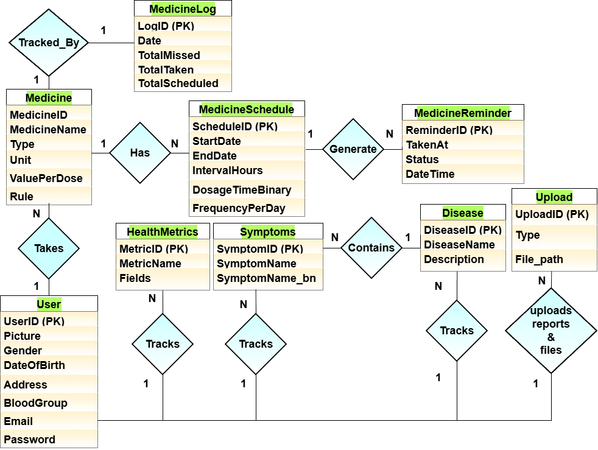
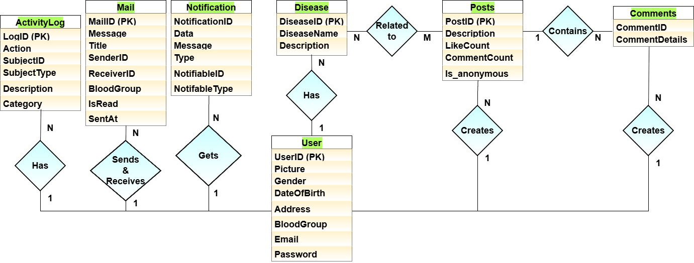

## API Documentation

### Authentication Endpoints

| Method | Endpoint | Description | Request Body | Response |
|--------|----------|-------------|--------------|----------|
| POST | `/login` | User login | `email`, `password`, `remember` | Redirect or JSON error |
| POST | `/logout` | End user session | None | Redirect to home |
| POST | `/register` | Create new user account | `Name`, `Email`, `password`, `Gender`, address fields | Redirect with verification |
| POST | `/forgot-password` | Send password reset link | `email` | JSON status |
| POST | `/reset-password` | Reset password | `email`, `password`, `token` | Redirect to login |
| GET | `/email/verify/{id}/{hash}` | Verify email address | None (signed URL) | Redirect to home |

### Health Tracking Endpoints

| Method | Endpoint | Description | Request Body | Response |
|--------|----------|-------------|--------------|----------|
| POST | `/health/metric` | Add health metric | `metric_type`, `recorded_at`, field values | Redirect |
| PUT | `/health/metric/{id}` | Update metric | Same as POST | Redirect |
| DELETE | `/health/metric/{id}` | Delete metric | None | Redirect |
| POST | `/health/symptom` | Log symptom | `symptom_name`, `severity_level`, `recorded_at`, `note` | Redirect |
| PUT | `/health/symptom/{id}` | Update symptom | Same as POST | Redirect |
| DELETE | `/health/symptom/{id}` | Delete symptom | None | Redirect |
| POST | `/health/disease` | Add disease record | `disease_id`, `status`, `diagnosed_at`, `notes` | Redirect |
| POST | `/health/upload` | Upload document | `title`, `type`, `file`, `doctor_name`, etc. | Redirect |

### Medicine Endpoints

| Method | Endpoint | Description | Request Body | Response |
|--------|----------|-------------|--------------|----------|
| POST | `/medicine/store` | Add medicine | `medicine_name`, `type`, `value_per_dose`, `unit`, `rule` | Redirect |
| PUT | `/medicine/{id}` | Update medicine | Same as POST | Redirect |
| DELETE | `/medicine/{id}` | Delete medicine | None | Redirect |
| POST | `/medicine/schedules` | Create schedule | `medicine_id`, `frequency_per_day`, `times[]`, `start_date` | Redirect |
| POST | `/medicine/reminders/{id}/taken` | Mark reminder taken | None | Redirect/JSON |
| GET | `/medicine/logs/export` | Export CSV | `medicine_id`, `days` | CSV file |

### Community Endpoints

| Method | Endpoint | Description | Request Body | Response |
|--------|----------|-------------|--------------|----------|
| POST | `/community/posts` | Create post | `disease_id`, `description`, `is_anonymous`, `files[]` | JSON |
| PATCH | `/community/posts/{id}` | Update post | `description` | JSON |
| DELETE | `/community/posts/{id}` | Delete post | None | JSON |
| PUT | `/community/posts/{id}/likes` | Toggle like | None | JSON |
| POST | `/community/posts/{id}/comments` | Add comment | `comment_details`, `file` | JSON |
| DELETE | `/community/comments/{id}` | Delete comment | None | JSON |
| GET | `/community/modal-post/{id}` | Get post HTML for modal | None | HTML |

### Admin Endpoints

| Method | Endpoint | Description | Request Body | Response |
|--------|----------|-------------|--------------|----------|
| GET | `/admin/users` | List users | `q` (search) | HTML view |
| PATCH | `/admin/users/{id}` | Update user | `name`, `email`, `role`, `is_active` | Redirect |
| POST | `/admin/diseases` | Create disease | `disease_name`, `disease_name_bn`, `description` | Redirect |
| POST | `/admin/symptoms` | Create symptom | `name`, `name_bn` | Redirect |
| PATCH | `/admin/community/posts/{id}/approve` | Approve post | None | JSON |
| GET | `/admin/logs` | View activity logs | `type`, `q` | HTML view |

### AI Chatbot Endpoints

| Method | Endpoint | Description | Request Body | Response |
|--------|----------|-------------|--------------|----------|
| POST | `/chatbot/message` | Send message to AI | `message`, `history` | JSON `{reply}` |
| POST | `/chatbot/about-me` | Get AI health summary | None | JSON `{reply}` |
| POST | `/chatbot/smart-suggestions` | Get personalized suggestions | None | JSON `{suggestions[]}` |

### Notification Endpoints

| Method | Endpoint | Description | Request Body | Response |
|--------|----------|-------------|--------------|----------|
| GET | `/notifications/unread-count` | Get unread count | None | JSON `{count}` |
| POST | `/notifications/{id}/read` | Mark as read | None | JSON |
| POST | `/notifications/{id}/star` | Toggle star | None | JSON |
| DELETE | `/notifications/{id}/delete` | Delete notification | None | JSON |

### Mailbox Endpoints

| Method | Endpoint | Description | Request Body | Response |
|--------|----------|-------------|--------------|----------|
| GET | `/profile/mailbox` | Inbox view | None | HTML view |
| GET | `/profile/mailbox/compose` | Compose message | `to`, `draft` | HTML view |
| GET | `/profile/mailbox/recipients/search` | Search users | `q` | JSON array |
| POST | `/profile/mailbox` | Send or save draft | `receiver_id`, `title`, `message`, `save_draft` | Redirect |
| PATCH | `/profile/mailbox/bulk/status` | Bulk update | `mailing_ids[]`, `status` | Redirect |
| DELETE | `/profile/mailbox/{mailing}` | Delete message | None | Redirect |

### Public Endpoints (No Auth Required)

| Method | Endpoint | Description | Response |
|--------|----------|-------------|----------|
| GET | `/` | Homepage | HTML view |
| GET | `/help` | Help center | HTML view |
| GET | `/privacy-policy` | Privacy policy | HTML view |
| GET | `/terms-of-service` | Terms of service | HTML view |
| GET | `/diseases` | Public disease catalog | HTML view |
| GET | `/symptoms` | Public symptom catalog | HTML view |
| GET | `/users/{user}` | Public user profile | HTML view |
| GET | `/geo/v2.0/divisions` | Get Bangladesh divisions | JSON |
| GET | `/geo/v2.0/districts/{divisionId}` | Get districts by division | JSON |
| GET | `/language/{locale}` | Switch language (en/bn) | Redirect |

---

## Screenshots

### Dashboard
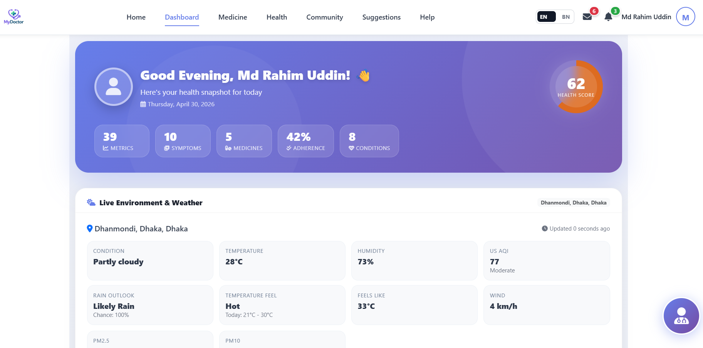

### Health Metrics
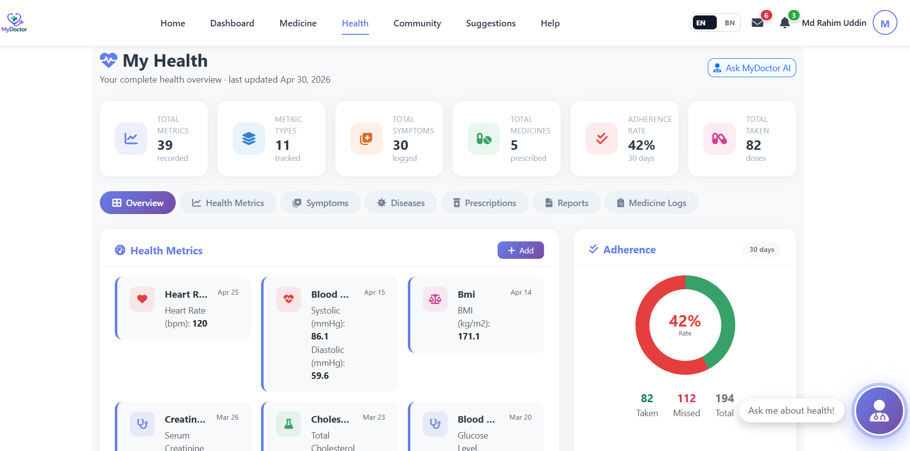

### Medicine Management
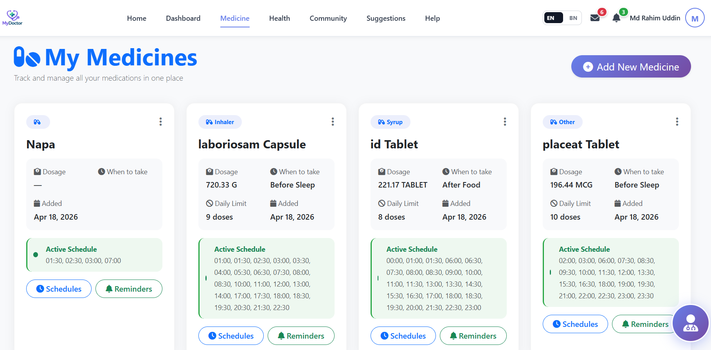

### Community Forum
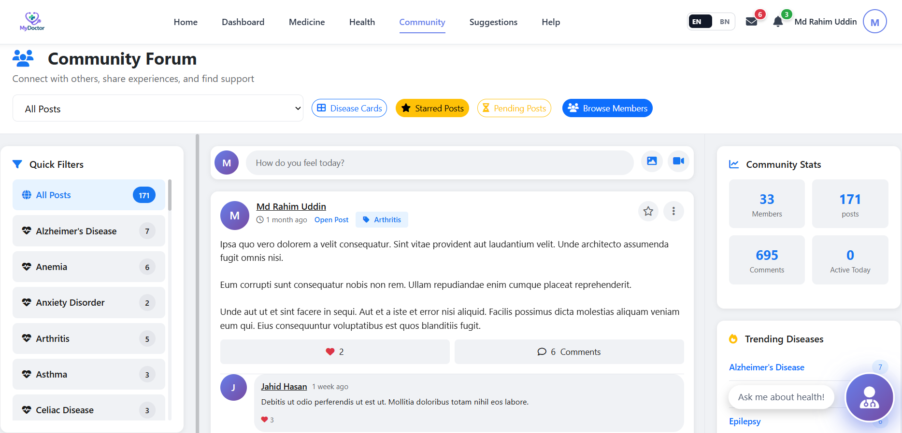

### AI Chatbot

<table>
  <tr>
    <td>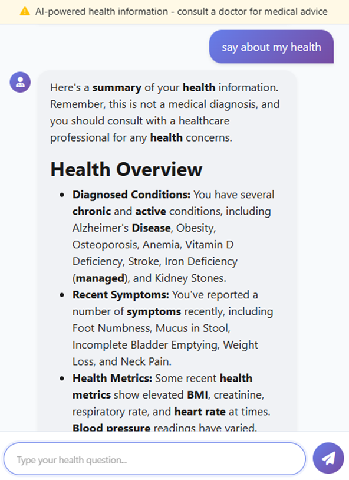</td>
    <td>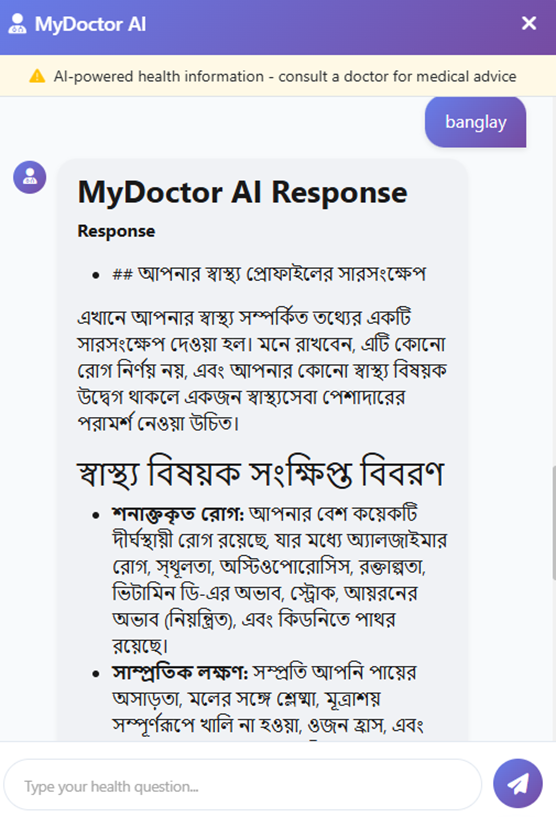</td>
  </tr>
  <tr>
    <td align="center"><em>English Conversation</em></td>
    <td align="center"><em>Bengali Conversation</em></td>
  </tr>
</table>

### Internal Mailbox
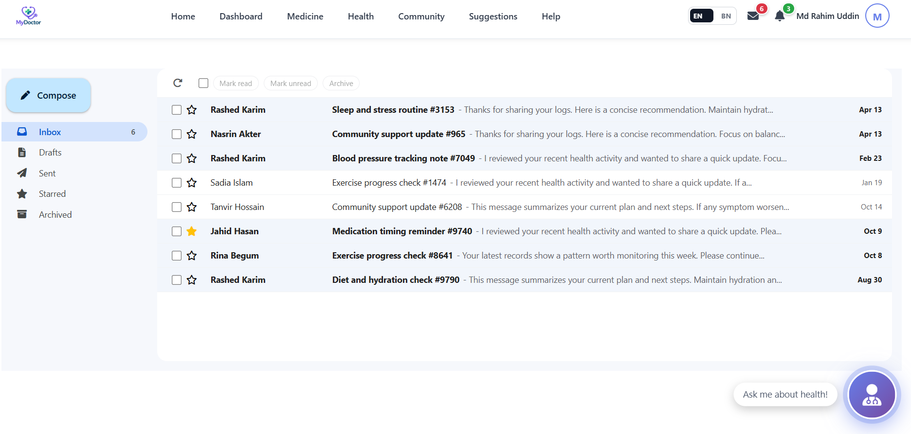

---

## Project Structure

```
mydoctor/
│
├── app/
│   ├── Console/
│   │   ├── Commands/
│   │   │   ├── AutoBackupCommand.php              # Automatic database backup command
│   │   │   ├── CheckCpanelReadiness.php           # cPanel environment check
│   │   │   ├── CleanBackupsCommand.php            # Clean old backups command
│   │   │   ├── ManualBackupCommand.php            # Manual backup command
│   │   │   └── SendMedicineReminders.php          # Cron job for medicine reminders
│   │   └── Kernel.php                              # Task scheduling definition
│   │
│   ├── Http/
│   │   ├── Controllers/
│   │   │   ├── Auth/
│   │   │   │   ├── EmailVerificationController.php
│   │   │   │   ├── ForgotPasswordController.php
│   │   │   │   ├── LoginController.php
│   │   │   │   ├── RegisterController.php
│   │   │   │   └── ResetPasswordController.php
│   │   │   ├── AdminActivityLogController.php     # Admin activity log viewer
│   │   │   ├── AdminBackupController.php          # Backup management
│   │   │   ├── AdminDashboardController.php       # Admin dashboard & stats
│   │   │   ├── AdminManagementController.php      # CRUD for diseases/symptoms/metrics/users
│   │   │   ├── AiChatController.php               # AI chatbot with text-to-SQL
│   │   │   ├── CommunityController.php            # Forum posts, comments, likes, reports
│   │   │   ├── Controller.php                     # Base controller
│   │   │   ├── DashboardController.php            # User dashboard
│   │   │   ├── GeoController.php                  # Bangladesh geography API proxy
│   │   │   ├── HealthController.php               # Health metrics, symptoms, diseases, uploads
│   │   │   ├── MaintenanceController.php          # Maintenance mode handler
│   │   │   ├── MailingController.php              # Internal mailbox system
│   │   │   ├── MedicineController.php             # Medicine CRUD
│   │   │   ├── MedicineLogController.php          # Medicine adherence logs
│   │   │   ├── MedicineReminderController.php     # Reminder management
│   │   │   ├── MedicineScheduleController.php     # Medicine schedules CRUD
│   │   │   ├── NotificationController.php         # User notifications
│   │   │   ├── NotificationPreferenceController.php # User notification settings
│   │   │   ├── ProfileActivityLogController.php   # User's own activity logs
│   │   │   ├── ProfileController.php              # User profile management
│   │   │   ├── PublicHealthController.php         # Public disease/symptom catalog
│   │   │   ├── SuggestionsController.php          # Smart health suggestions
│   │   │   └── UserController.php                 # User management & public profiles
│   │   │
│   │   ├── Middleware/
│   │   │   ├── AdminMiddleware.php                # Admin role check
│   │   │   ├── EnsureUserIsActive.php             # Block deactivated users
│   │   │   ├── LogUserActivity.php                # Track user actions
│   │   │   ├── MaintenanceMode.php                # Maintenance mode handler
│   │   │   ├── RedirectIfEmailNotVerified.php     # Email verification check
│   │   │   ├── RestrictGuestAccess.php            # Guest access restrictions
│   │   │   ├── SetLocale.php                      # Language detection
│   │   │   └── VerifyCsrfToken.php                # CSRF protection exceptions
│   │   │
│   │   ├── Kernel.php                             # Middleware registration
│   │   └── Requests/
│   │       └── ForgotPasswordRequest.php
│   │
│   ├── Jobs/
│   │   └── TestQueueJob.php                       # Queue test job
│   │
│   ├── Listeners/
│   │   ├── LogAuthenticationActivity.php          # Auth event listener
│   │   └── LogModelActivity.php                   # Model event listener
│   │
│   ├── Mail/
│   │   └── MedicineReminderMail.php               # Medicine reminder email
│   │
│   ├── Models/
│   │   ├── ActivityLog.php                        # User activity audit trail
│   │   ├── Comment.php                            # Post comments
│   │   ├── CommentLike.php                        # Comment likes
│   │   ├── Disease.php                            # Disease catalog
│   │   ├── Environment.php                        # Weather/environment data
│   │   ├── EnvironmentMetric.php                  # Environment metrics
│   │   ├── HealthMetric.php                       # Health metric definitions
│   │   ├── Mailing.php                            # Internal messages
│   │   ├── Medicine.php                           # User medicines
│   │   ├── MedicineLog.php                        # Daily adherence logs
│   │   ├── MedicineReminder.php                   # Individual reminders
│   │   ├── MedicineSchedule.php                   # Medicine schedules
│   │   ├── Notification.php                       # User notifications
│   │   ├── Post.php                               # Community posts
│   │   ├── PostLike.php                           # Post likes & stars
│   │   ├── Symptom.php                            # Symptom catalog
│   │   ├── Translation.php                        # Bangla translations
│   │   ├── Upload.php                             # Medical documents
│   │   ├── User.php                               # User account
│   │   ├── UserAddress.php                        # User address (Bangladesh)
│   │   ├── UserDisease.php                        # User disease records
│   │   ├── UserHealth.php                         # User health metrics
│   │   ├── UserSetting.php                        # User preferences
│   │   └── UserSymptom.php                        # User symptom logs
│   │
│   ├── Notifications/
│   │   ├── CustomVerifyEmail.php                  # Email verification
│   │   ├── MedicineEmailNotification.php          # Email notifications
│   │   ├── MedicineReminderNotification.php       # Database notifications
│   │   ├── PostApprovedNotification.php           # Post approval notification
│   │   ├── PostDeletedNotification.php            # Post deletion notification
│   │   ├── PostRejectedNotification.php           # Post rejection notification
│   │   ├── PostReportedNotification.php           # Post report notification
│   │   └── ResetPasswordNotification.php          # Password reset
│   │
│   ├── Policies/
│   │   ├── CommentPolicy.php
│   │   └── PostPolicy.php
│   │
│   ├── Providers/
│   │   ├── AppServiceProvider.php
│   │   ├── AuthServiceProvider.php
│   │   └── EventServiceProvider.php
│   │
│   └── Services/
│       ├── ActivityLogger.php                     # Structured audit logging
│       ├── BackupService.php                      # Database backup service
│       ├── CommunityNotificationService.php       # Community notifications
│       └── LiveEnvironmentService.php             # Weather & air quality API
│
├── bootstrap/
│   ├── app.php
│   └── cache/
│
├── config/
│   ├── app.php
│   ├── auth.php
│   ├── cache.php
│   ├── database.php
│   ├── filesystems.php
│   ├── health.php                                 # Health metrics & translations config
│   ├── logging.php
│   ├── mail.php
│   ├── queue.php
│   ├── services.php                               # API keys (OpenRouter, Google)
│   └── session.php
│
├── database/
│   ├── .gitignore
│   ├── factories/
│   │   ├── CommentFactory.php
│   │   ├── CommentLikeFactory.php
│   │   ├── DiseaseFactory.php
│   │   ├── EnvironmentFactory.php
│   │   ├── EnvironmentMetricFactory.php
│   │   ├── HealthMetricFactory.php
│   │   ├── MailingFactory.php
│   │   ├── MedicineFactory.php
│   │   ├── MedicineLogFactory.php
│   │   ├── MedicineReminderFactory.php
│   │   ├── MedicineScheduleFactory.php
│   │   ├── NotificationFactory.php
│   │   ├── PostFactory.php
│   │   ├── PostLikeFactory.php
│   │   ├── SymptomFactory.php
│   │   ├── UploadFactory.php
│   │   ├── UserAddressFactory.php
│   │   ├── UserDiseaseFactory.php
│   │   ├── UserFactory.php
│   │   ├── UserHealthFactory.php
│   │   └── UserSymptomFactory.php
│   │
│   ├── migrations/
│   │   ├── 0001_01_01_000000_create_users_table.php
│   │   ├── 0001_01_01_000001_create_cache_table.php
│   │   ├── 0001_01_01_000002_create_jobs_table.php
│   │   ├── 2026_03_03_162626_create_user_addresses_table.php
│   │   ├── 2026_03_03_162700_create_medicines_table.php
│   │   ├── 2026_03_03_162710_create_medicine_schedules_table.php
│   │   ├── 2026_03_03_162720_create_medicine_reminders_table.php
│   │   ├── 2026_03_03_162730_create_medicine_logs_table.php
│   │   ├── 2026_03_03_162740_create_symptoms_table.php
│   │   ├── 2026_03_03_162750_create_health_metrics_table.php
│   │   ├── 2026_03_03_162820_create_diseases_table.php
│   │   ├── 2026_03_04_100000_create_uploads_table.php
│   │   ├── 2026_03_04_100010_create_user_diseases_table.php
│   │   ├── 2026_03_09_185151_create_posts_table.php
│   │   ├── 2026_03_09_185419_create_comments_table.php
│   │   ├── 2026_03_09_185455_create_user_posts_table.php
│   │   ├── 2026_03_09_185550_create_post_comments_table.php
│   │   ├── 2026_03_11_100621_create_notifications_table.php
│   │   ├── 2026_03_22_000000_create_mailings_table.php
│   │   ├── 2026_04_09_100000_create_user_symptoms_table.php
│   │   ├── 2026_04_09_100010_create_disease_symptoms_table.php
│   │   ├── 2026_04_11_000000_create_user_health_table.php
│   │   ├── 2026_04_11_000001_create_user_setteings_table.php
│   │   ├── 2026_04_11_180000_create_user_starred_diseases_table.php
│   │   ├── 2026_04_12_000000_create_password_resets_table.php
│   │   ├── 2026_04_20_000000_create_activity_logs_table.php
│   │   ├── 2026_04_22_120000_create_operational_views_and_triggers.php  # DB views & triggers
│   │   └── 2026_04_22_200000_create_post_diseases_table.php
│   │
│   └── seeders/
│       ├── DatabaseSeeder.php
│       ├── DiseaseSeeder.php
│       ├── DiseaseSymptomSeeder.php
│       ├── HealthMetricSeeder.php
│       ├── HighVolumeDemoSeeder.php               # Demo data for testing
│       ├── MailingSeeder.php
│       ├── MedicalSeeder.php
│       ├── PatientProfilesSeeder.php              # 3 patient profiles
│       ├── SymptomSeeder.php
│       └── TranslationSeeder.php
│
├── lang/
│   ├── bn/
│   │   └── ui.php                                 # Bengali translations
│   └── en/
│       └── ui.php                                 # English translations
│
├── public/
│   ├── index.php
│   ├── .htaccess
│   ├── build/                                      # Compiled assets (Vite)
│   ├── images/
│   │   ├── logos/
│   │   │   ├── applogo.png
│   │   │   └── applogo_white.jpg
│   │   ├── banners/
│   │   │   └── Home banner.jpg
│   │   └── default-avatar.svg
│   └── storage/                                    # Symbolic link (user uploads)
│
├── resources/
│   ├── css/
│   │   └── app.css
│   ├── js/
│   │   ├── app.js
│   │   ├── bootstrap.js
│   │   └── community-modal.js                     # AJAX functions for community
│   │
│   └── views/
│       ├── layouts/
│       │   └── app.blade.php                      # Master layout
│       │
│       ├── admin/
│       │   ├── backups.blade.php                  # Backup management
│       │   ├── dashboard.blade.php                # Admin dashboard
│       │   ├── diseases.blade.php                 # Disease catalog management
│       │   ├── health.blade.php                   # Health metrics catalog
│       │   ├── logs.blade.php                     # Activity logs
│       │   ├── metric-show.blade.php              # Metric details
│       │   ├── reported-posts.blade.php           # Reported posts moderation
│       │   ├── symptoms.blade.php                 # Symptom catalog management
│       │   └── users.blade.php                    # User management
│       │
│       ├── auth/
│       │   ├── banned.blade.php
│       │   ├── forgot-password.blade.php
│       │   ├── login.blade.php
│       │   ├── register.blade.php
│       │   ├── reset-password.blade.php
│       │   └── verify-email.blade.php
│       │
│       ├── community/
│       │   ├── pages/
│       │   │   ├── home.blade.php                 # Disease cards view
│       │   │   ├── index.blade.php                # Posts feed with filters
│       │   │   ├── landing.blade.php              # Community landing page
│       │   │   ├── modal-post.blade.php           # AJAX modal for posts
│       │   │   ├── show.blade.php                 # Single post view
│       │   │   └── starred-diseases.blade.php     # Starred disease history
│       │   └── partials/
│       │       ├── comment.blade.php              # Comment component
│       │       └── post.blade.php                 # Post card component
│       │
│       ├── emails/
│       │   └── medicine-reminder.blade.php        # Email template
│       │
│       ├── health/
│       │   ├── index.blade.php                    # Health dashboard
│       │   ├── partials/
│       │   │   ├── diseases.blade.php
│       │   │   ├── medicine-logs.blade.php
│       │   │   ├── metrics.blade.php
│       │   │   ├── overview.blade.php
│       │   │   ├── prescriptions.blade.php
│       │   │   ├── summary-cards.blade.php
│       │   │   ├── symptoms.blade.php
│       │   │   └── uploads.blade.php
│       │   └── public/
│       │       ├── disease-show.blade.php
│       │       ├── diseases-index.blade.php
│       │       ├── symptom-show.blade.php
│       │       └── symptoms-index.blade.php
│       │
│       ├── medicine/
│       │   ├── add.blade.php                      # Add medicine
│       │   ├── edit.blade.php                     # Edit medicine
│       │   ├── logs.blade.php                     # Adherence logs
│       │   ├── my-medicines.blade.php             # User medicines list
│       │   ├── reminders.blade.php                # Reminders list
│       │   ├── schedule-create.blade.php          # Create schedule
│       │   ├── schedule-edit.blade.php            # Edit schedule
│       │   ├── schedules.blade.php                # Schedules list
│       │   ├── medicine.blade.php                 # Medicine landing page
│       │   ├── reminder-notifications.php
│       │   └── partials/
│       │       └── reminder-modal.blade.php
│       │
│       ├── notifications/
│       │   ├── index.blade.php                    # Notifications list
│       │   ├── starred.blade.php                  # Starred notifications
│       │   └── partials/
│       │       └── item.blade.php
│       │
│       ├── profile/
│       │   ├── archived.blade.php                 # Archived messages
│       │   ├── compose.blade.php                  # Compose message
│       │   ├── drafts.blade.php                   # Drafts list
│       │   ├── inbox.blade.php                    # Inbox
│       │   ├── logs.blade.php                     # Activity logs
│       │   ├── message.blade.php                  # Read message
│       │   ├── notifications.blade.php            # Notification preferences
│       │   ├── sent.blade.php                     # Sent messages
│       │   ├── setting.blade.php                  # Profile settings
│       │   └── starred.blade.php                  # Starred messages
│       │
│       ├── users/
│       │   ├── index.blade.php                    # Members directory
│       │   ├── public-show.blade.php              # Public user profile
│       │   └── show.blade.php                     # Admin user profile view
│       │
│       ├── dashboard.blade.php                    # User dashboard
│       ├── help.blade.php                         # Help center
│       ├── home.blade.php                         # Landing page
│       ├── maintenance.blade.php                  # Maintenance page
│       ├── privacy-policy.blade.php               # Privacy policy
│       ├── profile.blade.php                      # User profile
│       ├── suggestions.blade.php                  # Smart suggestions
│       ├── terms-of-service.blade.php             # Terms of service
│       └── welcome.blade.php                      # Laravel welcome (fallback)
│
├── routes/
│   ├── web.php                                    # All web routes (80+ endpoints)
│   ├── api.php                                    # API routes
│   └── console.php                                # Artisan commands
│
├── storage/
│   ├── app/
│   │   ├── backups/                               # Database backups
│   │   ├── public/                                # User uploaded files
│   │   └── temp/                                  # Temporary files
│   ├── framework/
│   │   ├── cache/
│   │   ├── sessions/
│   │   └── views/
│   └── logs/                                      # Application logs
│
├── tests/
│   ├── Feature/
│   ├── Unit/
│   └── TestCase.php
│
├── .env.example                                    # Environment template
├── .gitignore
├── artisan
├── composer.json
├── composer.lock
├── package.json
├── package-lock.json
├── vite.config.js
├── phpunit.xml
└── README.md
```

---


## Tech Stack

### Backend
- **Framework**: Laravel 11
- **Language**: PHP 8.2+
- **Database**: MySQL 8.0 (with views and triggers)
- **Queue**: Database driver (Redis-ready)
- **Cache**: Database driver (Redis-ready)
- **Session**: File driver (Database/Redis-ready)

### Frontend
- **Templating**: Blade with Bootstrap 5
- **JavaScript**: Vanilla JS with Bootstrap JS
- **Charts**: Chart.js
- **Rich Text**: TinyMCE (mailbox composer)
- **Icons**: Font Awesome 6

### AI & External Services
- **AI Providers**: OpenRouter API (primary), Google Gemini API (fallback)
- **Weather**: Open-Meteo API
- **Air Quality**: Open-Meteo Air Quality API
- **Geocoding**: Open-Meteo Geocoding API

### DevOps & Tools
- **Version Control**: Git
- **Asset Compilation**: Vite
- **Local Development**: Laravel Sail (Docker) or local PHP/MySQL

---

## Installation & Setup

### Prerequisites

- PHP 8.2 or higher
- Composer
- MySQL 8.0
- Node.js & NPM (for asset compilation)

### Step 1: Clone the Repository

```bash
git clone https://github.com/KaziRifatAlMuin/MyDoctor.git
cd MyDoctor
```

### Step 2: Install Dependencies

```bash
composer install
npm install
```

### Step 3: Environment Configuration

```bash
cp .env.example .env
php artisan key:generate
```

### Step 4: Run Migrations & Seeders

```bash
php artisan migrate --seed
```

### Step 5: Create Storage Link

```bash
php artisan storage:link
```

### Step 6: Compile Assets

```bash
npm run build
```

For development with hot reload:

```bash
npm run dev
```

### Step 7: Start Queue Worker (Recommended)

```bash
php artisan queue:work
```

### Step 8: Start Scheduler (Recommended)

```bash
php artisan schedule:work
```

### Step 9: Start the Application

```bash
php artisan serve
```

### Step 10: Setup Cron for Reminders (Production)

```bash
* * * * * php /path-to-project/artisan schedule:run >> /dev/null 2>&1
```

---

## Usage Guide

### For Regular Users

**1. Register an Account**
- Click "Register" on the homepage
- Fill in personal details including address (Division/District/Upazila)
- Verify your email using the link sent to your inbox

**2. Set Up Your Health Profile**
- Add your medicines via "Medicine → Add Medicine"
- Create schedules for each medicine (dosage times, frequency)
- Log health metrics like blood pressure or blood glucose

**3. Track Symptoms**
- Navigate to "Health → Symptoms"
- Log symptoms with severity levels (1-10)
- Add notes for context

**4. Use Medicine Reminders**
- Receive email and in-app notifications for medicines
- Click "Taken" when you take your medicine
- View adherence rates on dashboard

**5. Join the Community**
- Go to "Community" to see disease-based discussions
- Create posts (anonymous option available)
- Like, comment, and star posts for future reference
- Report inappropriate content to moderators

**6. Chat with AI Assistant**
- Click the chatbot icon (bottom-right corner)
- Ask questions like "How is my blood pressure trending?"
- Get personalized health summaries and suggestions

**7. Manage Your Mailbox**
- Send messages to other users
- Save drafts, star important conversations
- Archive old messages

### Sample Workflow: Managing Hypertension

1. User registers and logs in
2. Adds "Lisinopril 10mg" to medicines
3. Creates schedule: daily at 8:00 AM
4. System generates reminders
5. User receives notification at 8:00 AM
6. User clicks "Taken" after taking medicine
7. Dashboard shows adherence rate increasing
8. User logs blood pressure reading weekly
9. AI chatbot provides insights on trends
10. User discusses experiences in Hypertension community forum

---


## Future Improvements

- **WebSocket Notifications** - Replace polling with Laravel Reverb for real-time updates
- **Mobile Application** - Flutter or React Native companion app
- **Telemedicine Integration** - Video consultation with doctors
- **Health Data Export** - PDF reports for sharing with healthcare providers
- **Wearable Integration** - Connect with Fitbit, Apple Health, Google Fit
- **Advanced AI Features** - Symptom checker, medication interaction warnings
- **Multi-language Expansion** - Hindi, Urdu, Arabic support
- **Queue Worker Scaling** - Redis + Supervisor for production queue processing
- **Read Replicas** - Load balance SELECT queries for chatbot and reporting
- **CDN Integration** - Cloudflare R2 or AWS S3 for file storage across multiple servers
- **Two-Factor Authentication** - Enhanced account security
- **Offline Mode** - PWA support for mobile access without internet
- **API Rate Limiting** - Per-user throttling for API endpoints
- **Elasticsearch Integration** - Faster community post search

---

## Contributing

1. Fork the repository
2. Create a feature branch (`git checkout -b feature/amazing-feature`)
3. Commit your changes (`git commit -m 'Add amazing feature'`)
4. Push to the branch (`git push origin feature/amazing-feature`)
5. Open a Pull Request

### Coding Standards

- Follow PSR-12 coding standards
- Use Laravel naming conventions (controllers singular, models singular, tables plural)
- Write tests for new features when applicable
- Document API endpoints in controller docblocks
- Keep controllers slim; move business logic to models or services

---

## License

This project is licensed under the **MIT License**.

You are free to use, modify, and distribute this software for personal or commercial purposes, provided that the original copyright notice is included.

---

## Author / Credits

**Developed by** - Kazi Rifat Al Muin & Dipta Chowdhury

### Acknowledgments

- **Laravel Community** for the amazing framework
- **OpenRouter** for providing multi-model AI access
- **Google** for Gemini API
- **Open-Meteo** for free weather and air quality APIs
- **Bootstrap** and **Chart.js** teams for frontend tools
- **TinyMCE** for rich text editor

---

⭐ Star this repository if you find it useful!